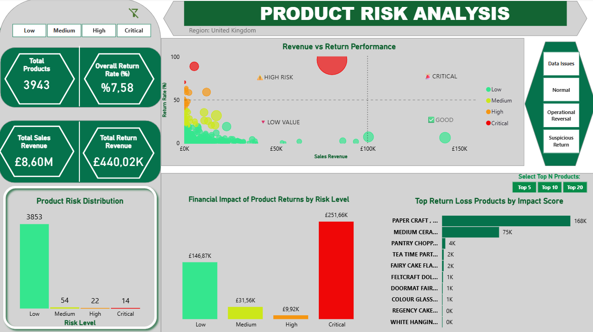

# Product Return Risk Analysis

This project analyzes product return behavior and identifies high-risk products using data analysis techniques in Python and interactive visualizations in Power BI.

## 📊 Project Overview

The goal of this project is to:
- Analyze product-level sales and return patterns
- Detect abnormal return behaviors
- Classify products based on return risk levels
- Visualize insights with an interactive Power BI dashboard

## 🧠 Methodology

### 1. Data Cleaning
- Filtered transactions to United Kingdom to ensure data consistency and reduce noise from multi-country variations
- Cleaned product descriptions
- Removed invalid and operational records

### 2. Feature Engineering
- Revenue = Price × Quantity
- Sales Revenue (only positive quantities)
- Return Revenue (only negative quantities)

### 3. Product Aggregation
Aggregated data at product level:
- Total sold quantity
- Total returned quantity
- Sales revenue
- Return revenue
- Return rate (%)

### 4. Anomaly Detection
Products were classified into:
- Normal
- Operational Reversal
- Suspicious Return
- Data Issues

### 5. Risk Segmentation
Based on return rate:
- Low (<20%)
- Medium (20–40%)
- High (40–70%)
- Critical (>70%)

### 6. Dashboard (Power BI)
Interactive dashboard includes:
- Revenue vs Return Rate analysis
- Risk distribution
- Financial impact of returns
- Top risky products (by impact score)
  
## 📁 Project Structure
```
data/
analysis.ipynb
product_analysis.csv
powerbi/
images/
README.md
```

## 📌 Key Insights

- A small number of products contribute to a large portion of return losses
- High return rates are not always linked with high revenue
- Identifying anomalies improves data reliability

## 🛠 Tools Used

- Python (Pandas, NumPy)
- Jupyter Notebook
- Power BI

## 📷 Dashboard Preview



## 📌 Data Source

- Online Retail II Dataset (UCI Machine Learning Repository)

